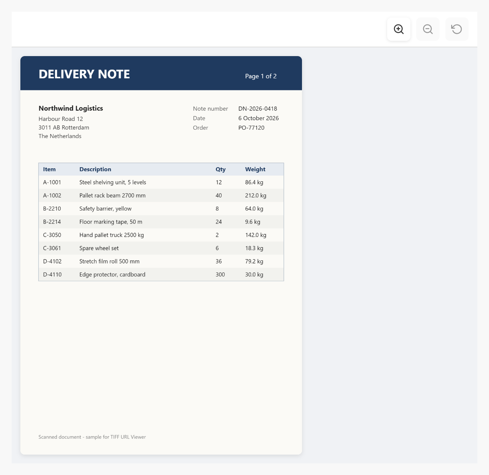

# TIFF URL Viewer

A Mendix pluggable widget that shows TIFF images in the browser. It loads the TIFF file from a URL in a String attribute (for example the URL of a Mendix file document), shows every page of the file, fits the pages to the box and offers optional Zoom in, Zoom out and Reset buttons.



## Documentation

- [TIFF URL Viewer 10.24.17.docx](docs/TIFF%20URL%20Viewer%2010.24.17.docx): install, upgrade, configuration, properties, examples, styling and limitations.
- [Marketplace documentation](docs/Marketplace%20Documentation%20-%20TIFF%20URL%20Viewer.md): the same in short form.

## Version 1.1.0 for Mendix Studio Pro 10.24.17

- Download `mendix.TiffURLViewer.mpk` from the release [Version1.1.0](https://github.com/bharathidas/TIFF-URL-Viewer/releases/tag/Version1.1.0) or from the root of this repository.
- The previous package (1.0.0, Mendix 10.18.4) is in release [Version1.0.0](https://github.com/bharathidas/TIFF-URL-Viewer/releases/tag/Version1.0.0).
- Copy it into the `widgets` folder of your app and press **F4** (App > Synchronize App Directory) in Studio Pro.
- Place **TIFF URL Viewer** in a data view.

## Properties

| Property | Type | Description |
| --- | --- | --- |
| TIFF URL | String attribute (required) | URL of the TIFF file: a Mendix file document URL (`/file?guid=...`) or a URL on a server that allows CORS. |
| Width | String attribute | CSS width such as `600px`, `100%` or `40rem`. A number without a unit is read as pixels. Empty: 600px. |
| Height | String attribute | CSS height such as `600px` or `80vh`. A number without a unit is read as pixels. Empty: 600px. |
| Show zoom controls | Boolean attribute | True shows the Zoom in, Zoom out and Reset buttons. |

The CSS classes `widget-tiffurlviewer`, `widget-tiffurlviewer-toolbar`, `widget-tiffurlviewer-button`, `widget-tiffurlviewer-page` and `widget-tiffurlviewer-error` can be used for styling.

## Changes in 1.1.0

See [the release notes](RELEASE-NOTES.md).

## Issues, suggestions and feature requests

https://github.com/bharathidas/TIFF-URL-Viewer/issues

## Source code and build

The widget source is in the [`tiffURLViewer`](tiffURLViewer) folder.

```
cd tiffURLViewer
npm install
npm run release
```

The package is created in `tiffURLViewer/dist/1.1.0/mendix.TiffURLViewer.mpk`. Node.js 16 or later is required.
